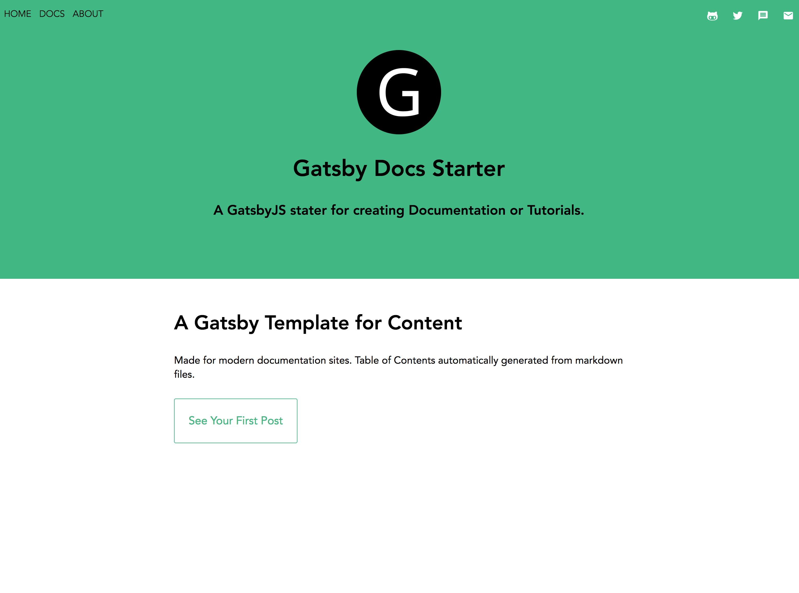
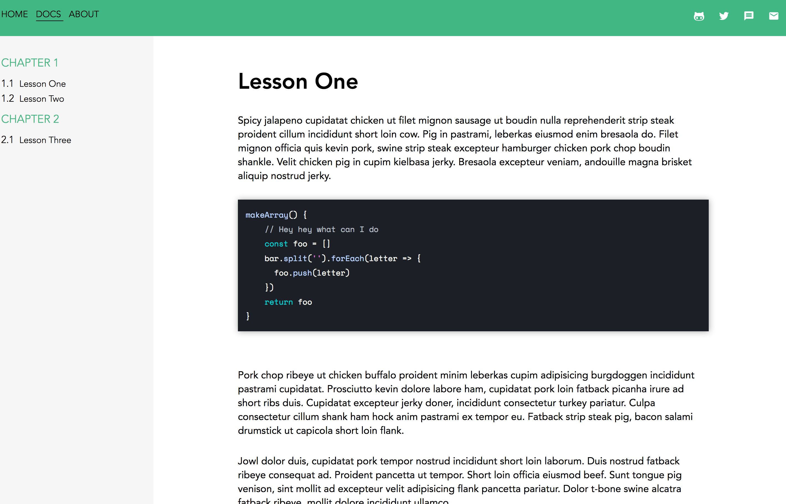

    

# Gatsby Docs Starter 1.0

#### This Project was forked from [Gatsby Advanced Starter](https://github.com/Vagr9K/gatsby-advanced-starter)

A starter skeleton with advanced features for [Gatsby](https://github.com/gatsbyjs/gatsby/).

Developed for creating Documentation or Tutorial websites.

### [Demo](https://gatsby-docs-starter.netlify.com/)

This template provides everything but the content. You could just write all your lessons in markdown files, configure a few lines of code, and have a completely built documentation website.

## Changelog

Updated 3/17/18

* Updated Table of Contents system: 
   * You now define your table of contents in the 'table_of_contents.json' file under the 'content' folder.
   * The GraphQl query in your 'lesson' template should match your table_of_contents.
   * The `TableOfContents` component does the rest.

This requires more upfront work, but I've found it to be infintely better when your page count gets high. It's easier to move things around and have the ToC **just work**.
   
* Basic styling added to the 'post' template
* mobile responsive
    
## Features

    

    

### New Features

* Basic UI
* Styled Components CSS w/ ThemeProvider for easy cross-site UI changes.
* Custom code-highlight theme
* React Icons
* Configured to auto generate documentation 'Table of Contents'
* You can also have blog posts.

### Updates

* December 23, 2017 - The 'Docs' page is now mobile responsive.

### These are the features from [Gatsby Advanced Starter](https://github.com/Vagr9K/gatsby-advanced-starter), which remain:  
* Blazing fast loading times thanks to pre-rendered HTML and automatic chunk loading of JS files
* Separate components for everything
* High configurability:
  * User information
  * User social profiles
  * Copyright information
  * More!
* Author segment
  * Name
  * Location
  * Description
  * Links
  * Follow Me button
* Posts in Markdown
  * Code syntax highlighting
  * Embed YouTube videos
  * Embed Tweets
* Tags
  * Separate page for posts under each tag
* Categories
  * Separate page for posts under each category
* Disqus support
  * Notifications about new disqus comments
* Google Analytics support
* NPM scripts for GitHub Pages deployment
* Social features
  * Twitter tweet button
  * Facebook share/share count
  * Reddit share/share count
  * Google+ share button
  * LinkedIn share button
  * Telegram share button
* SEO
  * Sitemap generation
  * robots.txt
  * General description tags
  * Schema.org JSONLD (Google Rich Snippets)
  * OpenGraph Tags (Facebook/Google+/Pinterest)
  * Twitter Tags (Twitter Cards)
* RSS feeds
* Loading progress for slow networks
* Offline support
* Web App Manifest support
* Development tools
  * ESLint for linting
  * Prettier for code style
  * Remark-Lint for linting Markdown
  * write-good for linting English prose
  * gh-pages for deploying to GitHub pages
  * CodeClimate configuration file and badge

*** 

### Notes
 [Ruben Harutyunyan](https://github.com/Vagr9K) did most of the hard work with [Gatsby Advanced Starter](https://github.com/Vagr9K/gatsby-advanced-starter).
 The rest of the credit is due to [Gatsby](https://github.com/gatsbyjs/gatsby/).
 

 WARNING: Make sure to edit `static/robots.txt` to include your domain for the sitemap!
